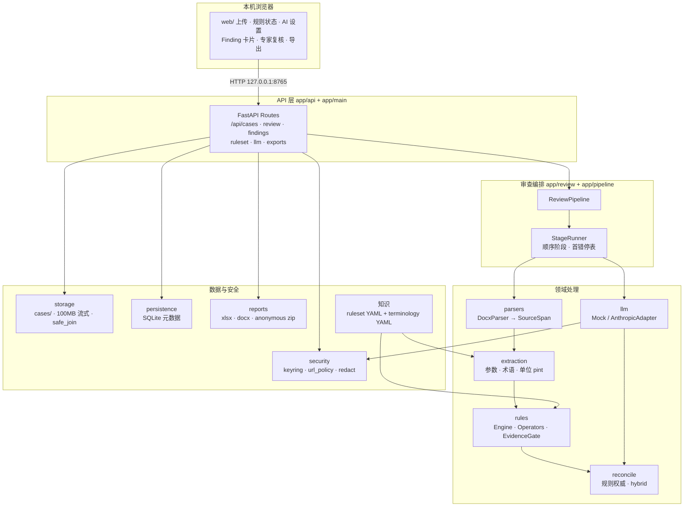
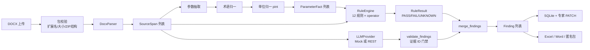
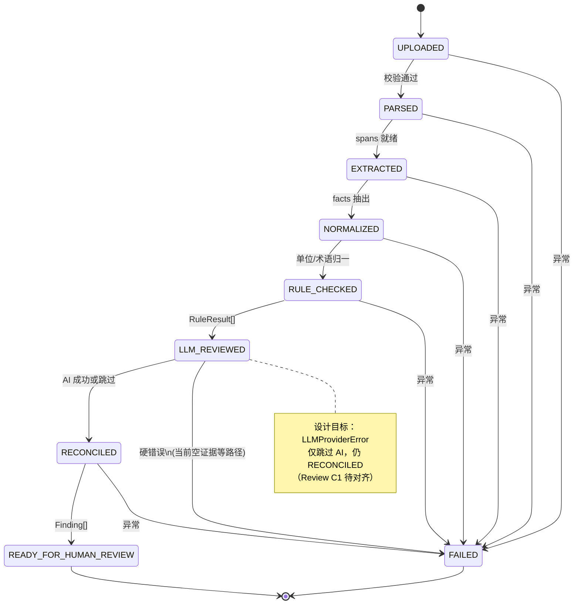
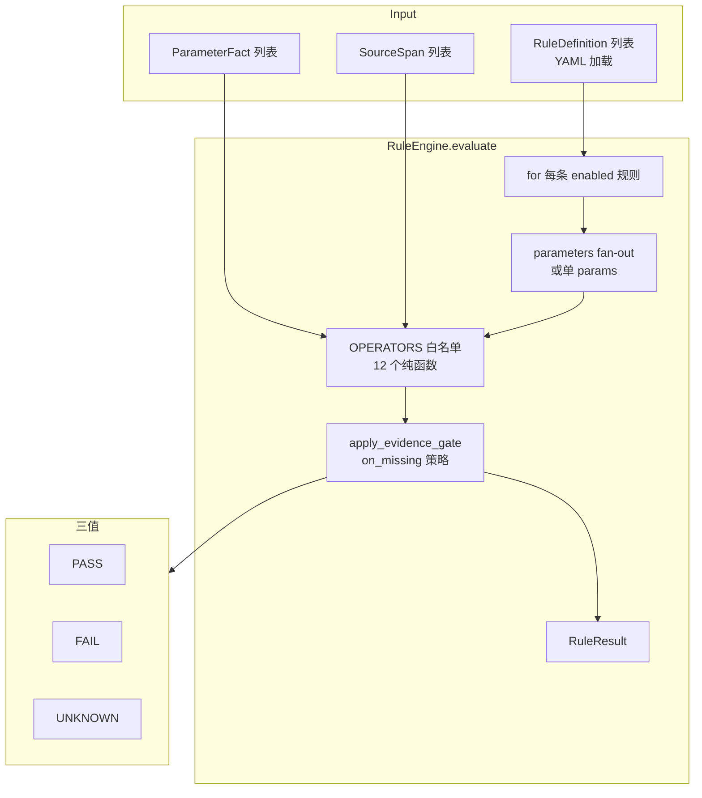
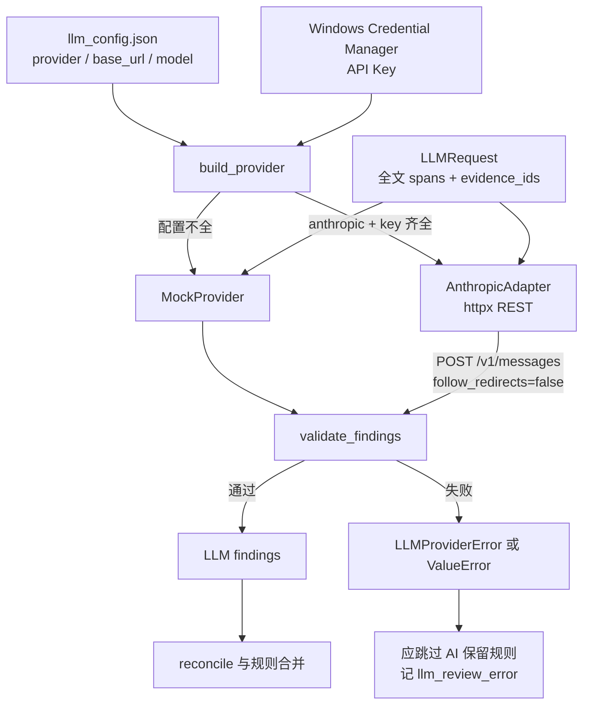
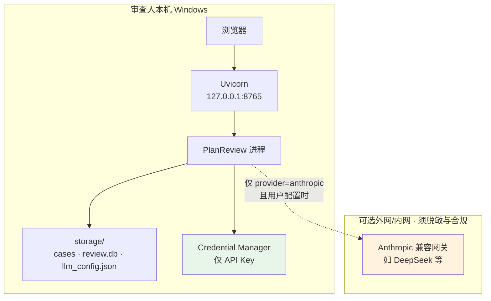
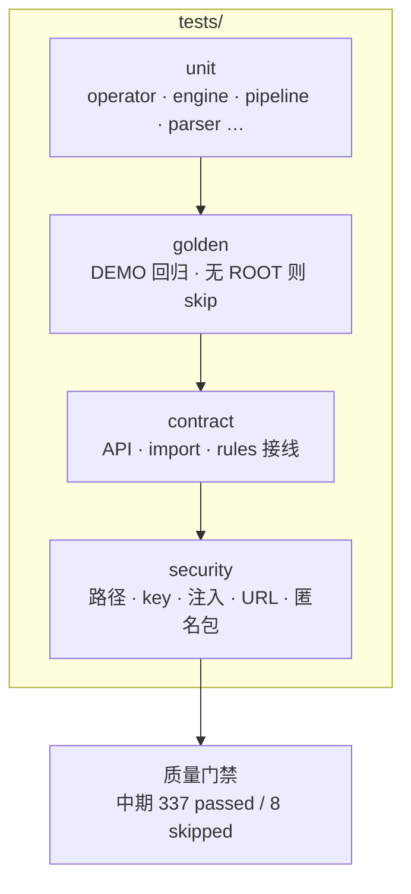
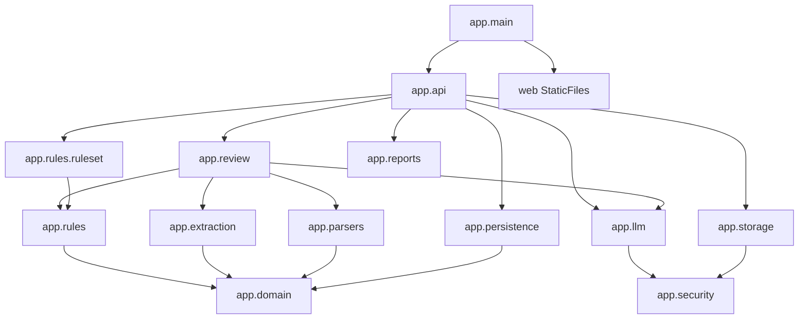

# 开发方案审查助手 · 中期报告（技术详述版）

| 项 | 内容 |
|----|------|
| **项目名称** | 开发方案审查助手（本地版 / PlanReview） |
| **业务归属** | 西南油气田公司 · AI 应用场景孵化工作坊 |
| **负责人** | 郑晓春（气田开发管理部）等 |
| **报告期** | 项目启动至 2026-07-15（约 10 日 MVP 冲刺期中后段） |
| **报告日期** | 2026-07-16 |
| **代码仓库** | https://github.com/whiteicey/PlanReview |
| **运行环境** | Python `>=3.12,<3.13`；Windows 本机演示；服务绑定 `127.0.0.1:8765` |
| **材料性质** | 中期进展 + **技术细节**；指标以仓库可复现结果为准，**不虚构业务 KPI** |

**关联文档：**  
[最终开题报告](../../开发方案审查助手_最终开题报告.md) · [结题技术报告](结题技术报告.md) · [Code Review 与修复方案合一](code-review-and-remediation-2026-07-15.md) · [golden 偏差](golden-status-deviation.md) · [使用手册](使用手册.md) · [online-LLM 设计](online-llm-adapter-plan.md)

**技术栈一览：** FastAPI / Uvicorn / Pydantic v2 / SQLAlchemy 2 / python-docx / openpyxl / pint / rapidfuzz / PyYAML / httpx / keyring / pytest。

---

## 〇、架构图（Mermaid）

> 以下图可在支持 Mermaid 的 Markdown 预览（VS Code、GitHub、多数文档站）中直接渲染。

### 0.1 逻辑分层总览



### 0.2 端到端数据流



### 0.3 流水线阶段状态机



### 0.4 规则引擎内部



### 0.5 LLM 子系统



### 0.6 部署与信任边界



### 0.7 测试金字塔



---

## 一、项目进展概述

### 1.1 总体进展

项目已交付**可安装、可测试、可浏览器演示**的本地智能初审内核。端到端主路径与 **§〇 架构图** 一致，文字摘要为：

```text
文本型 DOCX
  → DocxParser：OOXML 顺序遍历 → SourceSpan[]
  → extract_parameter_facts + TerminologyMap 归一 + pint 单位归一
  → RuleEngine：12 条 RuleDefinition × 白名单 operator → RuleResult[]（PASS/FAIL/UNKNOWN）
  → LLMProvider.review（Mock 默认 / Anthropic 兼容 REST 可选）→ 证据门禁 validate_findings
  → reconcile：规则权威合并 LLM → Finding[]
  → 持久化 SQLite + 专家 PATCH review_status/human_note
  → 导出 Excel / Word / 匿名 ZIP
```

流水线阶段由 `StageRunner` 顺序执行（`app/pipeline.py` + `app/review/pipeline.py`）：

| 阶段枚举 `PipelineStage` | 职责模块 |
|--------------------------|----------|
| `UPLOADED` | 案例 ID / 输入校验 |
| `PARSED` | 汇总 spans；`evidence_text_hashes` / `evidence_locations` |
| `EXTRACTED` | 参数抽取；可选 `source_version`（文件名 `V*`） |
| `NORMALIZED` | `normalize_facts_units` |
| `RULE_CHECKED` | `RuleEngine().evaluate` |
| `LLM_REVIEWED` | `provider.review`；失败应记 `llm_review_error` |
| `RECONCILED` | `rule_results_to_findings` + `merge_findings` |
| `READY_FOR_HUMAN_REVIEW` | 终态（成功） |
| `FAILED` | 首异常停表（硬错误） |

公开仓库、使用手册、独立 Code Review 与 TDD 修复清单已齐备。

### 1.2 相对开题计划

| 开题约定 | 中期技术状态 | 判定 |
|----------|--------------|------|
| 10 日 MVP | `app/` 53 个 py 模块级能力 + `web/` + `tests/` 58 测试模块 + DEMO 包 | **基本按计划** |
| 解析+完整性 | `DocxParser` + COMPLETENESS-001/002/003 | ✅ |
| 参数+规则核验 | extraction + 12 operator + 12 rules | ✅ 主路径；已知假绿项见 §4 |
| 多版本 | VERSION-001/002；`app/diff/{pairing,parameter_diff}.py` **有测无产品接线** | ⚠️ 偏离 |
| 定位+报告 | `format_span_location` + exporters + PATCH finding | ✅ |
| 混合架构 | 规则主、YAML 知识、LLM 辅 | ✅ 无向量 RAG |
| 效率 50% | 无专家对照实验 | 🔶 未测 |
| 自动审批 | 红线禁止 | ✅ 未做 |

### 1.3 偏离原因（技术视角）

| 偏离 | 技术原因 | 影响面 |
|------|----------|--------|
| 多版本 UI/API 未闭环 | 优先单文件 StageRunner 全绿与反假绿；`diff` 保持库级 API | 演示不能「双 DOCX 一键对照表」 |
| 无 PDF/OCR/RAG | 解析契约绑定 python-docx 文本层；OCR 噪声会污染 SourceSpan 证据链 | 仅文本 DOCX |
| 效率 KPI 未报 | 无标注工时数据集；测试是单元/契约/golden 而非业务 A/B | 管理口径需分离 |
| 在线 LLM 后置加固 | Adapter 已实现；Review 发现 `validate_llm_base_url` 过松、`config_store.save` 改 URL 不强制重输 key、LLM `ValueError` 与 `LLMProviderError` 不对称 | 默认 Mock 可演示 |
| 假绿曾现 | 早期 `legacy_compatibility` 扫正文结论句 | 已删；`tests/unit/test_compatibility_safety.py` 守门 |

### 1.4 进度判断

- **技术：** 中期可演示、可复现安装、可回归测试。  
- **业务：** 仍处 DEMO + 自动化验证。  
- **质量：** 第一性原理 / 对抗测试 / fail-closed 已成文；Review 问题已编号可修。

---

## 二、已完成工作汇报

### 2.1 数据收集与预处理（技术细节）

#### 2.1.1 数据资产分层

| 层级 | 内容 | 路径 / 存储 | 处理组件 |
|------|------|-------------|----------|
| 原始方案 | 文本 DOCX | 上传流 → `storage/cases/{uuid4}/documents/{sha256}-{name}` | `store_upload_streaming` |
| 结构层 | `SourceSpan` | 内存 + 审查后 hashes/locations 入 SQLite | `app/parsers/docx_parser.py` |
| 事实层 | `ParameterFact` | JSON 列于 `review_runs.facts` | `app/extraction/*` |
| 知识层 | 规则 + 术语 YAML | DEMO 包 / `repo_rules.yaml` | `app/rules/ruleset.py` loader |
| 金标层 | 案例期望 JSONL | `tests/golden/` + 外部 oracle | golden 测试 |
| 密钥层 | API Key | **仅** Windows Credential Manager | `app/security/credentials.py` |
| 配置层 | provider/base_url/model | `storage/llm_config.json`（无 key） | `app/llm/config_store.py` |

#### 2.1.2 上传与包校验（预处理第 0 步）

| 控制 | 实现要点 | 代码位置 |
|------|----------|----------|
| 扩展名白名单 | 仅 `.docx` | `settings.allowed_extensions` + `validate_upload_name` |
| 大小 | 流式累计，默认 **100MB** | `max_file_bytes`；超限 `UploadTooLargeError` → 413 |
| 路径安全 | `safe_join` 禁 `..`、绝对路径、盘符 | `app/storage/paths.py` |
| 案例 ID | UUID4，且字符串形式与 canonical 一致 | `_validate_uuid4` |
| DOCX 结构 | `is_zipfile` + 必须含 `[Content_Types].xml`、`word/document.xml` | `validate_docx_package` |
| 写入 | `O_EXCL` 不覆盖；失败删临时 `.part` | `case_files.py` |

**已知缺口：** 未校验 ZIP 成员未压缩大小（zip-bomb）；`max_pages=300` 在 settings 暴露但 **parser 未 enforce**。

#### 2.1.3 解析：DOCX → SourceSpan

`DocxParser.parse(path, document_id)`：

1. `Document(path)` 打开；失败 → `ParseError`。  
2. 遍历 `document.element.body` 子节点：  
   - `w:p` → `Paragraph`；非空 `text`；标题样式则更新 `section_path` 栈。  
   - `w:tbl` → 按行列扫 `cell.text`。  
3. 生成 `SourceSpan` 字段：

| 字段 | 含义 |
|------|------|
| `span_id` | `{document_id}:p:{i}` 或 `{document_id}:t:{ti}:{r}:{c}` |
| `section_path` | 当前标题路径列表 |
| `block_type` | `paragraph` / `heading` / `table_cell` |
| `text` / `text_hash` | 原文与 `sha256_text` |
| 行列/段落下标 | 导出「第 x 行第 y 列 / 第 n 段」用 |

`ParsedDocument` 同时保留 `paragraphs` / `table_cells` 分类列表。

#### 2.1.4 抽取与归一

| 步骤 | 模块 | 技术要点 |
|------|------|----------|
| 参数抽取 | `extraction/parameters.py` | 表格键值 + 正文正则；产出 `ParameterFact` |
| 术语归一 | `extraction/terminology.py` | `TerminologyMap`：`raw_name` 映射 `canonical_name` |
| 单位归一 | `extraction/normalization.py` | pint；`normalized_value: float` + `canonical_unit` |
| 比较键 | `ParameterFact.comparison_key` / `has_complete_key` | 要求 subject、time_scope、statistical_scope 齐全才参与多数一致性比较 |

`ParameterFact` 关键字段（领域模型）：

```text
fact_id, canonical_name, raw_name, raw_value,
normalized_value, raw_unit, canonical_unit,
subject, time_scope, statistical_scope, condition,
source_document, source_version, source_span_id,
extraction_method, confidence, human_status
```

#### 2.1.5 规则/术语自动发现（知识加载）

`resolve_ruleset_root()` / `load_active_ruleset()`（`app/rules/ruleset.py`）：

1. 若设 `REVIEW_DEMO_ROOT` 且为目录 → 用该根。  
2. 否则从包路径与 `cwd` **向上游走祖先**，找含哨兵  
   `本地版示例数据包/rules/ruleset-demo-0.1.yaml` 的目录。  
3. 加载术语 YAML（`aliases`）→ `load_production_rules`（外部 10 条，含 DEMO 字段到 `params` 的翻译）→ `load_repo_rules`（仓库 2 条；TERM-002 注入全量 terms）。  
4. API 进程缓存 `_RULESET_CACHE`；`POST /api/ruleset/reload` 可清缓存重载。  
5. 找不到规则包：**不硬崩**，`rules_loaded=false`，审查可走 LLM-only 并黄条提示。

YAML 安全：`yaml.safe_load` only。

#### 2.1.6 数据质量边界

| 边界 | 技术表现 |
|------|----------|
| 非 DOCX | HTTP 415 |
| 解析失败 | 422「仅处理文本型 DOCX」 |
| 抽取不全 | fact 缺失 → 规则 UNKNOWN 或漏检（记 golden-deviation） |
| 金标双轨 | 外部 oracle vs 仓内 mirror；偏差逐条文档化 |

---

### 2.2 「模型」选择与架构设计（技术细节）

#### 2.2.1 混合架构映射开题

| 开题组件 | 中期落地 | 模块 |
|----------|----------|------|
| 规则引擎 | 三值 + 12 operator 白名单 | `app/rules/{engine,operators,evidence,loader,registry,ruleset}.py` |
| 大模型 | Protocol + Mock + Anthropic REST Adapter | `app/llm/*` |
| 行业知识 | 规则 YAML + 术语 YAML（非向量库） | DEMO 包 + `repo_rules.yaml` |

#### 2.2.2 规则引擎内部机制

**输入：** `List[RuleDefinition]` + `List[ParameterFact]` + `List[SourceSpan]`。  
**输出：** `List[RuleResult]`。

```text
for rule in enabled_rules:
    parameter_sets = fan-out(rule.params["parameters"]) or [rule.params]
    for params in parameter_sets:
        outcome = OPERATOR[rule.operator](OperatorContext(facts, spans), params)
        outcome = apply_evidence_gate(outcome, rule)  # 仅处理 UNKNOWN 的 on_missing
        emit RuleResult(...)
```

**三值与 on_missing（`apply_evidence_gate`）：**

| operator 结果 | on_missing | 门禁后 |
|---------------|------------|--------|
| PASS / FAIL | * | 保持 |
| UNKNOWN | `fail` | → FAIL + human |
| UNKNOWN | `block` | 保持 UNKNOWN + `details.blocked` + human |
| UNKNOWN | `unknown` | 保持 UNKNOWN |
| 外部 `suspected` | loader 映射 | on_missing=unknown + `requires_human_review=True` |

**禁止：** `eval`/`exec`；动态注册任意代码；按 `rule_id` 硬编码业务分支（人工复核声明式）。

**12 个 operator（`OPERATOR_NAMES`）：**

| Operator | 主要算法要点 |
|----------|----------------|
| `required_sections_exist` | section 标签与 `section_path` 成员比较（当前含子串匹配，Review 建议改精确） |
| `required_parameter_table_exists` | section 含关键词 + 存在 table_cell |
| `all_equal` | 同参、同维度、usable 后集合 size==1 |
| `sum_equals` | 各操作数各取 1 个 complete 值；`sum(components)==target`（当前精确 `==`） |
| `product_approximately_equals` | 积与 right 相对容差（默认 0.05） |
| `less_or_equal` | left.normalized ≤ right.normalized |
| `change_requires_reason` | 多版本值变 → 扫回复区原因词；单版本一致 PASS；缺版本 UNKNOWN |
| `issue_response_status_exists` | 结构识别回复表头后，存在非空状态格即 PASS |
| `alias_normalization` | 术语归一判定（**生产路径假绿风险：先 normalize 再评**） |
| `evidence_required` | 当前实现偏 `len(spans)>=min`（**齿软**） |
| `reply_table_status_complete` | 表头识别状态列；每数据行状态非空 |
| `prose_alias_unnormalized` | 正文别名；过滤「别名⊂规范名」防误报；全量 terms 注入 |

**跨参数设计原则：** sum/product/≤ **不要求**不同操作数共享 time_scope（井数建设期 vs 处理能力设计值）；但每个操作数自身 comparison key 须完整且单值。

#### 2.2.3 LLM 子系统技术细节

| 组件 | 接口 / 行为 |
|------|-------------|
| `LLMRequest` | `model, system_prompt, user_content, evidence_span_ids` |
| `LLMResponse` | `provider, model, findings: list[dict], request_id?` |
| `validate_findings` | 必填字段；severity∈{high,medium,low}；evidence ⊆ 允许集合；**当前允许空列表（缺陷）** |
| `MockProvider` | 正文同时含「高峰产量」「超过处理能力」则返回 1 条 capacity finding；无网络 |
| `AnthropicAdapter` | `POST {base_url}/v1/messages`；headers: `x-api-key`, `anthropic-version: 2023-06-01`；`follow_redirects=False`；system 指令声明文档为数据；解析 JSON 数组或 fenced code；再 `validate_findings` |
| `build_provider` | anthropic 且 base_url+model+key 齐全 → Adapter，否则 Mock |
| 管道侧 user_content | `"\n".join(span.text for span in spans)`（全量正文拼接，无 token 预算） |

默认 base_url 配置倾向：`https://api.deepseek.com/anthropic`（用户可改）。

#### 2.2.4 合并与 Finding

`merge_findings`（`app/review/reconcile.py`）：

- 规则 finding 为权威（severity/描述不被 LLM 覆盖）。  
- 同键（category, parameter, 归一 title）可合并证据并标 `Origin.HYBRID`，强制 human review。  
- LLM finding 要求非空 evidence（reconcile 层再断言）。

`format_span_location` 示例：`附件A关键参数表 表格 第9行第2列`。

#### 2.2.5 选型理由（展开）

1. **可审计：** 监管场景需要「依据哪条规则、哪段原文」，规则引擎天然可指回 `rule_id` + `span_id`。  
2. **可回归：** operator 纯函数 + pytest；LLM 输出非确定，故不能当唯一门禁。  
3. **可运营：** 增规则改 YAML，不改 Python（新 operator 仍须进白名单与单测）。  
4. **可本地化：** 无强制云端；Mock 可离线演示。  
5. **可扩展：** Protocol 便于换网关；PDF 将来仍映射 SourceSpan。

---

### 2.3 关键技术难点与解决方案（展开）

#### 难点 A：假绿（prose-grep）

- **现象：** 用正文「建设周期冲突」等句直接当 finding 触发器。  
- **危害：** golden 绿但生产文档无答案句则失效；违反第一性原理。  
- **解决：** 删除兼容层；`test_compatibility_safety` 禁止复活；golden 按真实 operator 输出重标定（见 `golden-status-deviation.md` §3）。

#### 难点 B：三值状态与外部 DEMO 扩展态

- **现象：** 外部 SUSPECTED / BLOCK。  
- **解决：** 工程仅三态；suspected→unknown+人工；block→UNKNOWN+`details.blocked`。

#### 难点 C：跨参数 scope 误伤

- **现象：** 要求 sum 操作数同 time_scope → DEMO-001 干净案大量 UNKNOWN。  
- **解决：** `_one_complete_fact_per_operand` 按操作数独立取完整单值，不强制跨操作数同 scope。

#### 难点 D：中文领域词写库 422

- **现象：** `_safe_identifier` ASCII-only 校验 `canonical_name`/parameter。  
- **解决：** `_safe_vocabulary` 允许 CJK 与单位斜杠；evidence 列表上限抬到 20000。

#### 难点 E：LLM 与规则失败语义不对称（未完全解决）

- **现象：** `LLMProviderError` 保留规则；空 evidence / `ValueError` 导致 StageRunner FAILED 且 `findings=[]`。  
- **现状：** 已记录为 Review **C1**；修复方案见合一文档 Task 1。  
- **单测固化：** `test_review_pipeline_failure.py` 仍期望 FAILED——修复时需改测。

#### 难点 F：TERM-001 语义与管道顺序（未完全解决）

- **现象：** pipeline 先 `normalize_facts` 再 `alias_normalization`，后者见 canonical 即 PASS。  
- **解决方向：** 按 `raw_name∈aliases` 判 FAIL（Task 4）；全量术语注入（Task 5）。

#### 难点 G：本地安全 vs 内网网关

- **现象：** 业务要连内网/兼容网关 → `validate_llm_base_url` 放宽 http/私网。  
- **张力：** 与密钥同存时放大 SSRF/泄钥面（C3/C4）。  
- **方向：** 默认严格 + 显式「允许内网」+ 改 URL 强制重输 key。

---

### 2.4 工程交付清单（模块级）

| 包路径 | 职责 |
|--------|------|
| `app/domain/` | enums、schemas、exceptions |
| `app/parsers/` | DocxParser |
| `app/extraction/` | parameters、terminology、normalization、sections |
| `app/rules/` | engine、operators、evidence、loader、ruleset、repo_rules.yaml |
| `app/diff/` | pairing、parameter_diff（库级） |
| `app/review/` | pipeline、reconcile |
| `app/llm/` | provider、mock、factory、config_store、adapters/anthropic |
| `app/persistence/` | models、db（含 schema 增量）、repository |
| `app/reports/` | excel/word/anonymous |
| `app/security/` | credentials、url_policy、logging |
| `app/storage/` | paths、case_files、hashing |
| `app/api/` | routes、schemas |
| `web/` | index.html、app.js（escapeHtml）、styles.css |
| `tests/{unit,golden,contract,security}/` | 四层测试 |
| `scripts/run_local.py` | `uvicorn` host=127.0.0.1 port=8765 |

依赖见 `pyproject.toml`；`deferred` extra 含 pymupdf/OCR/SDK 等**未装默认依赖**。

#### 2.4.1 代码包依赖关系（示意）



---

## 三、阶段性成果展示

### 3.1 数据样本与质量分析

#### 3.1.1 样本矩阵（演示建议）

| 样本类型 | 验证目标 | 关注规则 |
|----------|----------|----------|
| 干净基线 | 反向：少误报 | 合计/完整性 PASS 或诚实 UNKNOWN |
| 综合缺陷 | 正向：多 finding | COMPLETENESS / CONSISTENCY / CAPACITY 等 |
| 回复表缺状态 | 行级完整 | COMPLETENESS-003 |
| 别名正文 | 术语 | TERM-002（TERM-001 待修） |
| 版本相关 | 变更原因 | VERSION-001/002 |

示例路径约定：`本地版示例数据包/plans/DEMO-*.docx`（以仓内实名为准）。

#### 3.1.2 质量分析（技术）

| 维度 | 方法 | 结论 |
|------|------|------|
| 格式 | 契约测 415/422 | 边界清晰 |
| 定位 | span_id → format_span_location → Excel location 列 | 识别报告可用 |
| 匿名 | 字段白名单 + opaque enum + hash | 无正文/位置/厂商 |
| 金标 | mirror vs oracle 文档化偏差 | 诚实，非静默改期望 |
| 注入 | content-as-data 安全测 | Mock 不执行文档内「指令」 |

#### 3.1.3 已知数据能力上限（摘录）

见 `docs/golden-status-deviation.md`：单文档时序矛盾、unknown_scope、部分参数 36/38 抽取限制等——**引擎诚实做不到的不强行报对**。

---

### 3.2 评估指标与性能分析

#### 3.2.1 工程回归（已测）

| 指标 | 结果 | 复现 |
|------|------|------|
| pytest | **337 passed, 8 skipped** | `python -m pytest -q`（无 DEMO_ROOT） |
| 带 DEMO_ROOT | 以执行机为准 | `REVIEW_DEMO_ROOT=... python -m pytest -q` |
| 警告 | pytest `asyncio_mode` 配置警告 | 不影响通过数 |
| 反作弊 | compatibility_safety 存在 | 防假绿回潮 |

#### 3.2.2 规则能力矩阵（中期）

| 规则 ID | Operator | 中期可用性 | 技术备注 |
|---------|----------|------------|----------|
| COMPLETENESS-001 | required_sections_exist | 高 | 子串匹配有 false-PASS 风险（R7） |
| COMPLETENESS-002 | required_parameter_table_exists | 高 | |
| COMPLETENESS-003 | reply_table_status_complete | 高 | 表头识别列；0 数据行语义可再严 |
| CONSISTENCY-001 | all_equal | 高 | incomplete → UNKNOWN |
| CONSISTENCY-002 | sum_equals | 中高 | 缺单位检查；精确浮点（R5/R6） |
| CONSISTENCY-003 | product_approximately_equals | 中高 | 有相对容差 |
| CAPACITY-001 | less_or_equal | 中高 | 缺单位兼容检查 |
| VERSION-001 | change_requires_reason | 中 | 单版本 PASS；产品双文件未接线 |
| VERSION-002 | issue_response_status_exists | 中高 | 非空状态即存在 |
| TERM-001 | alias_normalization | **低（假绿）** | R1/R2 |
| TERM-002 | prose_alias_unnormalized | 中高 | 全量 terms |
| EVIDENCE-001 | evidence_required | **低（齿软）** | R3 |

#### 3.2.3 LLM 路径评估

| 项 | 中期 |
|----|------|
| Mock | 确定性演示；契约/浏览器可复现 |
| Adapter 单测 | mock transport；无 CI 真网 |
| 失败可见性 | `llm_review_error` **未进** ReviewSummary（I1） |
| 空证据 | 可导致整管线 FAILED（C1） |

#### 3.2.4 业务 KPI

| 指标 | 状态 |
|------|------|
| 效率 +50% | **未测** |
| 生产漏审/误报率 | **不可外推** |

#### 3.2.5 性能与资源量级

| 项 | 观察 |
|----|------|
| 本地规则审查 | 样例文档通常秒级～十余秒（机器相关） |
| 在线 LLM | 受网关时延与全文 prompt 体积支配 |
| 内存 | 大 DOCX 全量 spans 常驻；无页数硬顶时风险上升 |
| GPU | 不需要 |

---

### 3.3 场景适配性初步验证

| 场景 | 验证手段 | 适配结论 | 限制 |
|------|----------|----------|------|
| 完整性 | 规则+DEMO+API | 适配文本结构方案 | 子串章节误匹配风险 |
| 参数一致性/汇总/产能 | operator 单测+golden | 适配 | 单位/ incomplete 待加固 |
| 多版本 | VERSION operator | 规则语义部分适配 | **无双文件产品流** |
| 共性问题初筛 | 12 规则清单 | 适配重复性核对 | 非地质智能诊断 |
| 报告初稿 | xlsx/docx 导出 | 适配初审清单 | 非正式审查意见书 |

---

### 3.4 原型系统可视化演示（技术说明）

#### 3.4.1 进程与路由

```bash
python scripts/run_local.py
# uvicorn app.main:app --host 127.0.0.1 --port 8765
```

| 方法 | 路径 | 作用 |
|------|------|------|
| GET | `/` | StaticFiles → `web/` |
| GET | `/api/health` | status + disclaimer |
| GET | `/api/config` | 扩展名、max_file_bytes、max_pages、disclaimer |
| GET/POST | `/api/ruleset` `/api/ruleset/reload` | 规则状态/重载 |
| GET/POST | `/api/llm/config` | 读/写 LLM 配置（key 不回显） |
| POST | `/api/llm/health` | 探测 provider |
| POST | `/api/cases` | 上传 → 201 CaseCreated |
| POST | `/api/cases/{id}/review` | 跑 ReviewPipeline → ReviewSummary |
| GET | `/api/cases/{id}/findings` | Finding 列表 |
| PATCH | `/api/findings/{id}` | 专家状态/备注 |
| GET | `/api/cases/{id}/exports/{xlsx\|docx\|anonymous}` | 导出 |
| POST/DELETE | 回收站/永久删除 | 二次确认 `DELETE {case_id}` |

#### 3.4.2 前端技术要点（`web/app.js`）

- Finding 字段一律 `escapeHtml` 防 XSS。  
- 规则未加载黄条；空 findings 文案强调「不代表方案正确」。  
- 导出为 `<a href="/api/cases/.../exports/...">` 直链。  
- API Key 保存后清空输入框。  
- **缺口：** 未渲染 `final_status===FAILED` / `llm_review_error`（C2/I1）。

#### 3.4.3 演示脚本（建议 5 分钟）

1. 终端展示 `pytest -q` 绿。  
2. 启动服务，浏览器打开 loopback。  
3. 加载规则库 → 显示约 12 条。  
4. 上传缺陷 DEMO → 展示多卡片与证据处数。  
5. 专家确认一条 → 刷新状态。  
6. 导出 Excel 打开「问题位置」列。  
7. （可选）Mock 命中产能话术的正文。  

#### 3.4.4 演示红线话术

AI 初审 ≠ 正式结论；未出问题 ≠ 方案正确；效率 50% 本阶段未宣称。

---

## 四、遇到的问题与调整方案

### 4.1 问题清单（含技术证据索引）

| ID | 问题 | 关键位置（摘要） | 严重度 |
|----|------|------------------|--------|
| C1 | LLM 校验失败抹规则 finding | `review/pipeline.py` llm_reviewed；StageRunner | Critical |
| C2 | FAILED 在 UI 像没问题 | `routes.review_case`；`web/app.js` | Critical |
| C3 | 改 base_url 保留旧 key | `llm/config_store.py` save | Critical |
| C4 | LLM URL 过松 + 密钥 | `url_policy.validate_llm_base_url` | Critical |
| R1–R2 | TERM-001 假绿 / 首条术语 | operators.alias_normalization；ruleset 注入 | Critical |
| R3 | EVIDENCE-001 齿软 | operators.evidence_required | Critical |
| R4–R7 | 跨参数/章节 | operators 算术与 section | Important |
| I1–I10 | 可见性/持久化/页数/session/diff/文档… | 见合一 Review 文档 | Important |

全文证据与改法：**[code-review-and-remediation-2026-07-15.md](code-review-and-remediation-2026-07-15.md)**。

### 4.2 已采取措施与效果

| 措施 | 效果 |
|------|------|
| 删除 legacy 兼容层 + 守门测 | 假绿主路径关闭 |
| StageRunner + sanitize_error | 硬错误可观测、少泄路径 |
| SourceSpan 全链路 | 可追溯导出 |
| keyring + 配置分离 | key 不进 SQLite/JSON |
| `_safe_vocabulary` | 中文事实可持久化 |
| 规则自动发现 | 演示少配环境 |
| Review 合一文档 | 可分工 TDD 修复 |

### 4.3 计划调整

| 原假设 | 调整 |
|--------|------|
| 同期 RAG/PDF | **维持延后** |
| 立即生产用在线 LLM | **P0 修复后**再试点 |
| 效率 50% 随 MVP 公布 | **单列实验阶段** |
| 多版本靠规则即可 | **补产品接线**为下阶段硬目标 |
| 架构方向 | **不调整**（规则主、LLM 辅、本地优先） |

---

## 五、下一步工作计划

### 5.1 阶段 A：修复冲刺（1–2 周）— 技术任务

按合一文档 Part B：

| Task 簇 | 技术目标 | 验收 |
|---------|----------|------|
| 1–3 | LLM 失败只跳过 AI；Summary 暴露 llm 状态；可选 ORM 字段 | 失败测改绿；UI 有黄条 |
| 4–6 | TERM raw_name 判定；全量术语；evidence 按 fact-span 链接 | operators 对抗测 |
| 7–8 | incomplete/单位/sum isclose；章节精确匹配 | 单测 |
| 9–10 | URL/密钥门控；页数与 zip 上限 | security 测 |
| 11–14 | 持久化启发式、session、专家状态、文档 | 契约/手册 |
| 15 | 全量 pytest + 诚实报告 | 记录 skip/未测项 |

### 5.2 阶段 B：产品补齐（2–4 周）

| 任务 | 技术要点 |
|------|----------|
| 双文件 API | cases 多文件或配对确认 endpoint |
| 接线 `app/diff` | pairing + parameter_diff → 变更 Finding/表 |
| 规则运营最小集 | 版本字段展示、启停、reload 审计 |
| 试点数据包 | 脱敏 DOCX 固定集 + 期望说明 |

### 5.3 阶段 C：试点评估（1 业务周期）

专家对照实验（样本 n、基线工时、漏审定义）→ **有口径的** KPI；决定 LLM/PDF 是否扩大。

### 5.4 重点攻关

1. 规则诚实性（R1–R3 等）  
2. LLM fail-closed 对称（C1/C2/I1）  
3. 安全门控（C3/C4）  
4. 多版本产品路径  
5. 可外推业务验证  

### 5.5 预期成果

- P0/P1 关闭 + 测试绿  
- 多版本最小演示  
- 实验方案书（非必然已有 50% 数字）  

---

## 六、资源与支持需求

### 6.1 数据

| 需求 | 用途 | 优先级 |
|------|------|--------|
| 脱敏真实/准真实 DOCX（多版本更佳） | 抽取与规则标定、试点 | **高** |
| 历史意见（脱敏） | 共性问题→规则 | 中 |
| 结构化审查清单/规范条目 | 扩展 YAML | 中 |
| PDF/扫描件 | 仅 PDF 立项后 | 低 |

### 6.2 算力

| 需求 | 说明 |
|------|------|
| 开发本机 | 已足够（规则路径） |
| 内网 LLM 额度 | 试点可选 |
| 训练 GPU 集群 | **不需要** |

### 6.3 技术支持

| 需求 | 优先级 |
|------|--------|
| 专家口径答疑窗口 | **高** |
| 正文出网 LLM 合规书面口径 | **高** |
| 2–4 人周开发（修复+多版本） | **高** |
| 私有镜像托管（若需要） | 中 |
| 试点制度文本 | 中 |

### 6.4 团队协作情况

| 维度 | 现状 |
|------|------|
| 模式 | 小团队 + 计划驱动（24 Task SDD）+ AI 辅助 |
| 代码 | GitHub PlanReview；注意 main/worktree 文档漂移 |
| 质量 | 独立 Review + 合一修复文档可分工 |
| 待加强 | 双周规则误报/漏报过堂（专家×开发） |

**建议分工：** A LLM/API；B 规则引擎；C 安全/限额；D 多版本+文档；专家裁定口径；负责人资源与合规。

### 6.5 外部协作需求

| 外部方 | 协作 | 优先级 |
|--------|------|--------|
| 开发管理部/审查专家 | 口径、试用、对照实验 | **高** |
| 信息/安全部门 | 出网与密钥规范 | **高** |
| 编制/数据提供方 | 脱敏样本 | **高** |
| 井/地面/经济接口人 | 专业规则扩展 | 中 |
| LLM 网关方 | endpoint/额度/审计 | 中（试点） |
| 档案/审查系统 | 接口草案 | 低（远期） |

### 6.6 管理口径

- 中期**不**报「效率已 +50%」。  
- 统一话术：AI 初审 + 专家复核，非自动审批。  
- 下一阶段硬交付建议：**Review P0 关闭 + 多版本接线 + 真实样本实验方案**。

### 6.7 暂不需要

大规模 GPU、公网多租户运维、正式 OA 对接开发、商业标注平台。

---

## 七、中期结论（技术摘要）

1. **架构已落地：** DocxParser → ParameterFact → 三值 RuleEngine → 可选 LLM → reconcile → 导出，代码与测试可复现。  
2. **主路径可演示：** 12 规则、自动发现、专家复核、三类导出、Mock LLM。  
3. **诚实债务已识别：** TERM/EVIDENCE 假绿、LLM 失败语义、密钥/URL、多版本产品流、页数未强制等，均有文件级证据与 Task。  
4. **业务 KPI 未测：** 效率数字不得提前透支。  
5. **请求：** 脱敏真实样本、专家与合规支持、修复与多版本人力。

---

## 附录 A · 12 条规则全表

| ID | 名称 | Operator | 来源 |
|----|------|----------|------|
| COMPLETENESS-001 | 必备章节存在 | required_sections_exist | 外部 |
| COMPLETENESS-002 | 关键参数表存在 | required_parameter_table_exists | 外部 |
| COMPLETENESS-003 | 审查意见回复表状态完整 | reply_table_status_complete | 仓库 |
| CONSISTENCY-001 | 开发井总数跨位置一致 | all_equal | 外部 |
| CONSISTENCY-002 | 分类井数等于总井数 | sum_equals | 外部 |
| CONSISTENCY-003 | 单井产能与总设计产能关系 | product_approximately_equals | 外部 |
| CAPACITY-001 | 高峰产量不超过地面处理能力 | less_or_equal | 外部 |
| VERSION-001 | 关键参数变化需要说明 | change_requires_reason | 外部 |
| VERSION-002 | 上一轮意见应存在回复状态 | issue_response_status_exists | 外部 |
| TERM-001 | 参数别名应归一 | alias_normalization | 外部 |
| TERM-002 | 正文参数别名未归一 | prose_alias_unnormalized | 仓库 |
| EVIDENCE-001 | 问题必须关联原文证据 | evidence_required | 外部 |

COMPLETENESS-001 必备章节配置：总则与编制说明、项目概况、开发部署方案、产能与生产预测、井工程方案、地面工程方案、结论与实施建议。

---

## 附录 B · 领域对象与 API 摘要

**核心类型：** `SourceSpan` · `ParameterFact` · `RuleDefinition` · `RuleResult` · `Finding` · `ReviewRun` · `StageRecord`。

**ReviewSummary 字段（中期）：** `case_id, final_status, finding_count, fact_count, stages, rules_loaded, rule_count`（待增 `llm_completed` / `llm_review_error`）。

---

## 附录 C · 复现命令

```bash
python -m pip install -e ".[dev]"
python -m pytest -q
python -m pytest tests/security -q
python scripts/run_local.py
# 浏览器 http://127.0.0.1:8765
# 可选：REVIEW_DEMO_ROOT="…/本地版示例数据包" python -m pytest -q
```

---

## 附录 D · 指标口径声明

测试通过数、规则条数、模块列表可在仓库复现。  
**效率、生产漏审率**须另附实验方案与原始记录，不得与本中期技术通过数混报。

---

**报告结束（技术详述版）。**
