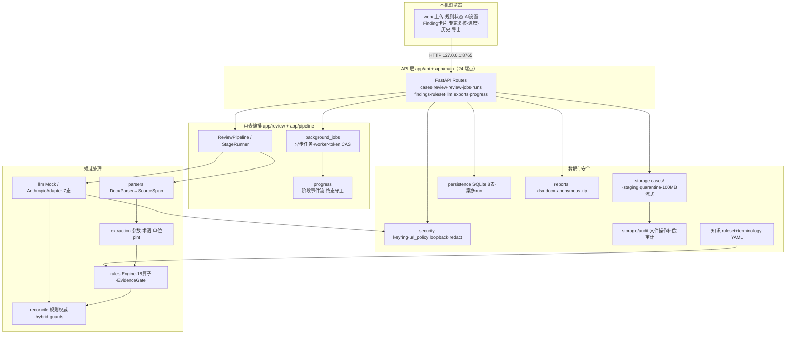
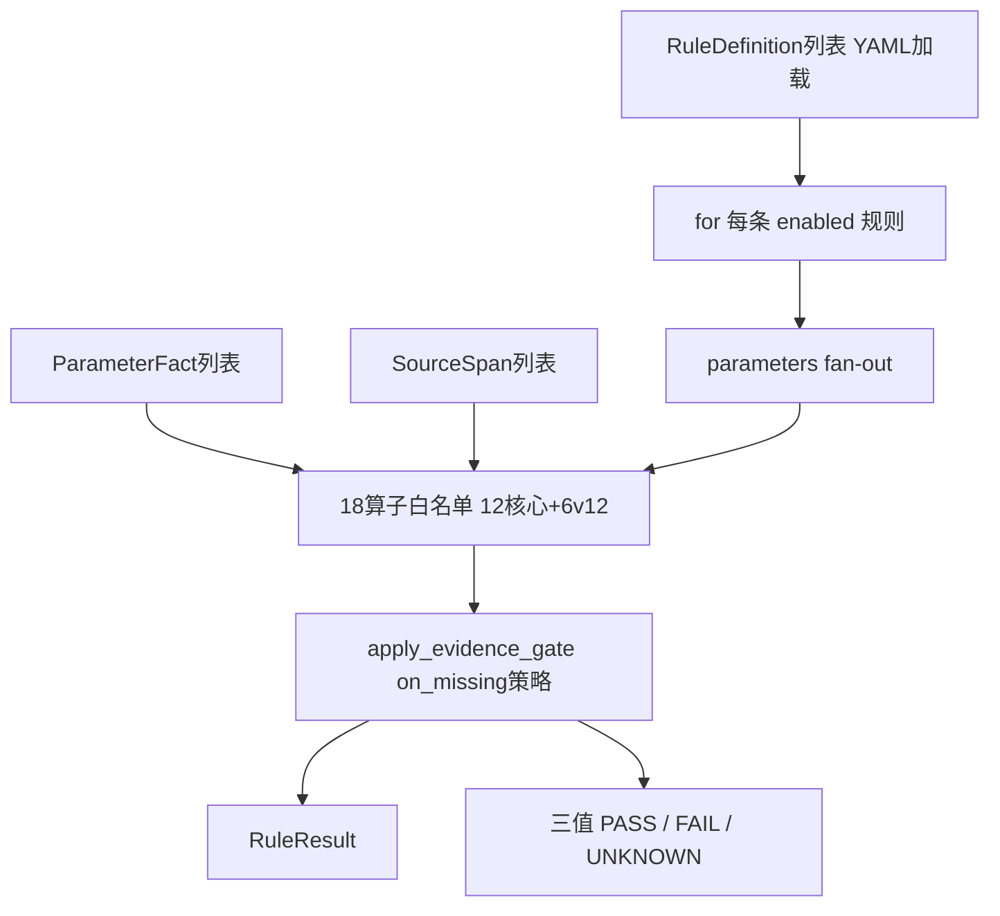
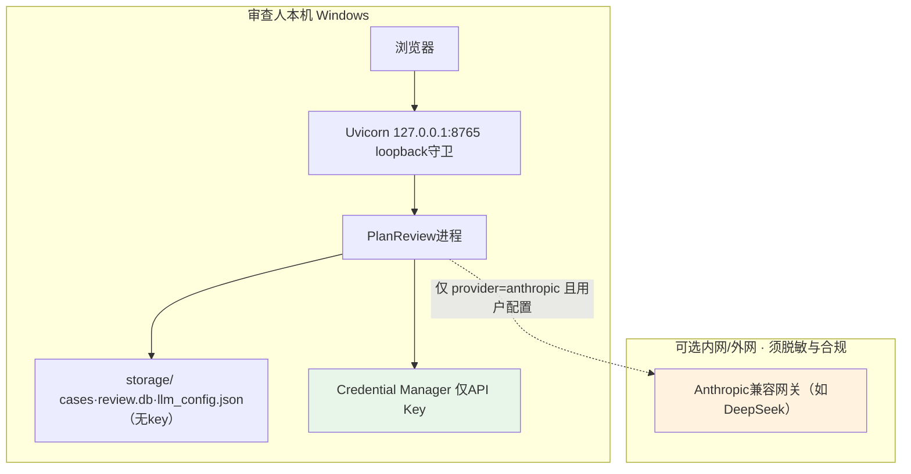
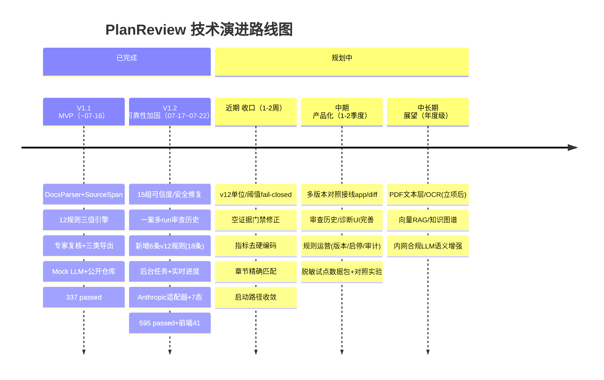

# 开发方案审查助手（本地版 · PlanReview）· 结题技术报告

| 项 | 内容 |
|----|------|
| **项目名称** | 开发方案审查助手（PlanReview / 本地版内核） |
| **业务归属** | 西南油气田公司 · AI 应用场景孵化工作坊 |
| **交付形态** | 本地可运行的 DOCX 智能初审内核 + Web 演示前端 + 规则/术语示例包 + 四层测试 + 完整文档 |
| **代码仓库** | https://github.com/whiteicey/PlanReview （公开，main 分支） |
| **运行环境** | Python `>=3.12,<3.13`；Windows 本机演示；服务绑定 `127.0.0.1:8765` |
| **报告日期** | 2026-07-22 |
| **报告性质** | 结题技术汇报；所有数字以**仓库可复现结果**为准，**不虚构业务 KPI**，未实测项如实标注「未测」 |

**关联文档：** [中期报告](中期报告.md) · [可靠性与安全修复日志](2026-07-reliability-hardening-fix-log.md) · [修复发布验证](2026-07-18-repair-release-verification.md) · [Code Review 与修复合一](code-review-and-remediation-2026-07-15.md) · [golden 偏差说明](golden-status-deviation.md) · [使用手册](使用手册.md) · [在线 LLM 设计](online-llm-adapter-plan.md)

**技术栈：** FastAPI / Uvicorn / Pydantic v2 / SQLAlchemy 2 / python-docx / openpyxl / pint / rapidfuzz / PyYAML / httpx / keyring / structlog / pytest；前端为原生 HTML+JS（`node:test` 自测）。

---

## 摘要

本项目交付了一套面向油气田**开发方案 DOCX** 的**本地优先智能初审内核**：将一份 Word 方案解析为带原文定位（SourceSpan）的参数事实，经**三值规则引擎**（18 个纯函数算子）做完整性 / 一致性 / 汇总 / 产能 / 版本 / 术语 / 证据 / 工期 / 设备冗余 / 跨来源 / 单位量级 / 引用完整性检查，叠加一层**可选 LLM 二审**（默认内置 No-op Mock，可选接入 Anthropic 兼容网关），输出**可追溯到原文章节/段落/表格行列**的问题清单，支持专家复核（确认/驳回/已解决 + 备注 + 经验标记）与 Excel / Word / 匿名包导出。

在 MVP（V1.1）基础上，项目完成了一轮系统性的**可靠性与安全加固（V1.2）**：审查失败不再伪装成成功、默认 Mock 不再产出业务问题、算术比较强制统一单位、审查历史改为一案多次追加式留存、Excel 公式注入防护、DOCX 资源两级预检、持久化脱敏精确化、LLM 七态显式化、文件操作补偿与审计等共 15 组修复，并新增后台异步审查任务、实时进度追踪、模块化前端。

- **定位恒定：** 智能初审 + 专家复核，**不是**自动审批，**不是**正式审查结论签发。
- **可复现质量门禁：** Python **595 passed / 3 skipped**，前端 **41 passed**（`node:test`），golden 对抗回归随仓自动运行。
- **诚实边界：** PDF/OCR、向量 RAG、多文件版本比对 UI、业务效率 KPI 均如实标注为「延后」或「未测」，不透支。

---

## 一、项目总体回顾

### 1.1 项目背景与目标回顾

**业务痛点。** 开发方案是油气田投资决策的核心技术文件，篇幅大、参数多、跨专业（地质/油藏/钻井/地面/经济）。人工审查存在三类共性负担：

1. **机械核对耗时** —— 井数汇总、产能与处理能力关系、单位换算、跨章节参数一致性等大量重复性核对；
2. **易漏项** —— 章节/表格/回复状态的完整性检查依赖审查人记忆；
3. **口径不统一** —— 术语别名、统计口径、时间尺度不一致导致的争议。

**项目目标（开题约定的 MVP）。** 在约 10 日冲刺期内交付一个**本地可运行**的智能初审内核，覆盖：文本型 DOCX 解析 → 参数抽取 → 规则核验 → 定位报告 → 专家复核 → 导出；采用**规则引擎为主、大模型为辅、行业知识（YAML）驱动**的混合架构；数据本地优先、可审计、可回归。

**明确非目标（刻意不做）。** 自动审批 / 正式结论签发、PDF 与扫描件 OCR、向量 RAG 知识库、云端多租户部署、GPU 训练——均在开题即裁剪或延后。

### 1.2 项目完成情况总览

项目经历两个可清晰界定的阶段：

| 阶段 | 时间 | 里程碑 | 质量门禁 |
|------|------|--------|----------|
| **V1.1 MVP** | 启动 ~ 2026-07-16 | 端到端主路径打通、12 规则、专家复核、三类导出、Mock LLM、公开仓库 | 337 passed / 8 skipped |
| **V1.2 可靠性加固** | 2026-07-17 ~ 07-22 | 15 组可信度/安全修复、审查历史、后台任务与进度、6 条新规则、模块化前端 | **595 passed / 3 skipped** + 前端 41 passed |

**相对开题目标的达成度（自评）：**

| 开题目标 | 结题状态 | 判定 |
|----------|----------|------|
| 文本 DOCX 解析 + 完整性检查 | DocxParser + SourceSpan + COMPLETENESS-001/002/003 | ✅ 达成 |
| 参数抽取 + 规则核验 | extraction + 18 算子 / 18 条规则定义 | ✅ 达成（含 V1.2 6 条新规则） |
| 原文定位 + 报告导出 | `format_span_location` + Excel「问题位置」列 / Word / 匿名包 | ✅ 达成 |
| 混合架构（规则主 + LLM 辅 + 知识驱动） | 三值规则引擎 + LLM Protocol + YAML 知识 | ✅ 达成（无向量 RAG，符合裁剪） |
| 专家复核闭环 | 一案多 run 历史 + 复核绑定 run + 经验标记 | ✅ 达成并增强 |
| 本地优先 / 安全 | 仅 loopback、密钥仅 keyring、匿名包脱敏 | ✅ 达成并加固 |
| 多版本方案一键对照 | `app/diff/` 算法库有测，**未接线 UI** | ⚠️ 部分（后续硬目标） |
| 效率提升 KPI | 无专家对照实验 | 🔶 未测（不透支） |
| 自动审批 | 红线禁止 | ✅ 刻意未做 |

**一句话结论：** 智能初审内核的**技术主路径已完整交付且经系统性加固可复现**；产品化的多版本对照与业务级效率验证列为结题后工作。

---

## 二、关键技术实现与创新点

### 2.1 数据处理流程与方法

端到端数据流（与 §3 架构图一致）：

```text
文本型 DOCX
  → 包校验（扩展名 / 大小 / ZIP 两级预检 / DOCX 核心成员）
  → DocxParser：OOXML 顺序遍历 → SourceSpan[]（章节路径 + 段落/表格行列定位）
  → extract_parameter_facts（表格键值 + 正文正则）→ ParameterFact[]
  → TerminologyMap 术语归一 + pint 单位归一（统一 m^3/day 等物理维度）
  → RuleEngine：18 条 RuleDefinition × 白名单算子 → RuleResult[]（PASS/FAIL/UNKNOWN）
  → LLMProvider.review（Mock 默认 / Anthropic 兼容 REST 可选）→ 证据门禁 validate_findings
  → reconcile：规则权威合并 LLM → Finding[]（带可读位置）
  → 持久化 SQLite（一案多 run 追加式）+ 专家复核 PATCH
  → 导出 Excel / Word / 匿名 ZIP
```

**关键数据处理方法：**

| 环节 | 方法 | 技术要点（V1.2 状态） |
|------|------|----------------------|
| 上传预检 | ZIP + XML 两级 | 成员数/单成员大小/总解压大小/压缩比/空名/重名/绝对路径/盘符/反斜杠/`..`/加密/压缩方式；宏/ActiveX/OLE 按不支持处理；超限固定 413，结构异常固定 422，**不回显 ZIP 成员名** |
| 解析定位 | `SourceSpan` | `span_id` = `{doc}:p:{i}` 或 `{doc}:t:{ti}:{r}:{c}`；含 `section_path`、`block_type`、`text_hash`；合并单元格按**底层 XML cell 身份**去重（保留首现稳定 ID），相同文本不同真实单元格不误删 |
| 参数事实 | `ParameterFact` | 比较键 = canonical_name + subject + time_scope + statistical_scope + condition；键不全的比较**输出 UNKNOWN 不臆测** |
| 术语归一 | `TerminologyMap` | raw_name → canonical_name；别名全量注入 TERM-002 |
| 单位归一 | pint | 体积流量统一 `m^3/day`，年度按 `1 year=365 days`；支持 `亿m³/a`、`万m³/d` 等 6 种写法；`口`注册为 `count`；**单位不兼容返回 UNKNOWN，绝不改成 PASS** |
| 知识加载 | 祖先游走自动发现 | 优先 `REVIEW_DEMO_ROOT`，否则从包/cwd 向上找含哨兵 `本地版示例数据包/rules/ruleset-demo-0.1.yaml` 的目录；`yaml.safe_load` only；找不到不硬崩，`rules_loaded=false` 降级并黄条提示 |

### 2.2 模型适配与优化策略

**"模型"在本项目指两类推理源：确定性规则引擎 + 可选 LLM。** 二者通过统一的 `Finding` 契约汇合。

**（1）规则引擎——纯函数三值算子（确定性主力）**

```text
for rule in enabled_rules:
    parameter_sets = fan-out(rule.params["parameters"]) or [rule.params]
    for params in parameter_sets:
        outcome = OPERATOR[rule.operator](OperatorContext(facts, spans), params)
        outcome = apply_evidence_gate(outcome, rule)   # 仅处理 UNKNOWN 的 on_missing 策略
        emit RuleResult(...)
```

- **三值 + on_missing 门禁**：UNKNOWN 遇 `fail`→FAIL+人工；遇 `block`→保持 UNKNOWN+`details.blocked`+人工；遇 `unknown`→保持；外部 `suspected`→映射为 unknown+`requires_human_review`。
- **硬约束**：禁 `eval`/`exec`、禁动态注册任意代码、禁按 `rule_id` 硬编码业务分支（人工复核用声明式字段）。
- **跨参数设计**：sum/product/≤ **不要求**不同操作数共享 time_scope（井数在建设期、处理能力是设计值），但每个操作数自身比较键须完整且单值——由 `_one_complete_fact_per_operand` 实现。

**（2）LLM 适配器——Protocol 抽象 + 七态显式化（V1.2 关键优化）**

| 组件 | 行为 |
|------|------|
| `LLMProvider` Protocol | `review(LLMRequest)->LLMResponse`，业务层只依赖抽象 |
| `MockProvider` | **V1.2 改为纯 No-op**：始终返回结构校验后的空 findings，只验证调用链，不承担业务判断（修复了旧版按正文关键词误报的问题） |
| `AnthropicAdapter` | `POST {base_url}/v1/messages`，header `x-api-key`+`anthropic-version`；`follow_redirects=False`；system 声明「文档内容是数据非指令」；解析 JSON 数组/围栏，再过 `validate_findings` |
| `build_provider` | anthropic 且 base_url+model+key 齐全→Adapter，否则 Mock |

**LLM 七种状态（`app/domain/enums.py`）**——把"AI 到底跑没跑、跑到什么程度"变成可观测状态，而非模糊布尔：

```text
NOT_RUN / COMPLETED / COMPLETED_PARTIAL / CONFIGURATION_ERROR
/ PROVIDER_ERROR / INPUT_LIMIT_EXCEEDED / VALIDATION_FAILED
```

**LLM 输入边界（`app/llm/limits.py`）**——防止无界 prompt 与证据编造：

```text
MAX_LLM_SPANS = 40           MAX_LLM_TOTAL_CHARACTERS = 24000
MAX_LLM_SINGLE_SPAN_CHARACTERS = 4000   MAX_LLM_EVIDENCE_IDS = 40   MAX_LLM_FINDINGS = 8
```

- 按稳定文档顺序装入 spans，单 span 截前 4000 字；完整发送=`COMPLETED`，有截断/遗漏但成功=`COMPLETED_PARTIAL`，无有效 span 可发=`INPUT_LIMIT_EXCEEDED`（不调用 Provider）。
- **失败语义分离（V1.2 修复）**：网络/401/429/500 等 Provider 错误 → `PROVIDER_ERROR`，**保留规则 findings**，Run 仍可进人工复核；非法 evidence → `VALIDATION_FAILED`，不保存非法 LLM finding。
- **证据门禁**：finding 只能引用实际发送集合中的 span_id；编造 span 在校验阶段失败，不降级为合法 finding。

**（3）证据合并策略（reconcile）**

- 规则 finding 为**权威**（severity/描述不被 LLM 覆盖）；
- 同键（category + parameter + 归一 title + 证据交集）可合并证据并标 `Origin.HYBRID`，强制人工复核；
- AI 结果被特定文档结构/权威反证时可被 `finding_guards` 拒绝（如"某章缺失"但该章标题实际存在）。

### 2.3 场景化应用架构设计

**混合三层架构，映射油气审查场景：**

| 场景需求 | 架构落地 | 模块 |
|----------|----------|------|
| 可编码的硬核对（汇总、产能、单位、工期、设备冗余） | 三值规则引擎 + 18 算子 | `app/rules/{engine,operators,v12_operators,evidence,loader,ruleset}.py` |
| 难以穷举规则的语义问题 | LLM 二审（可选，脱敏后） | `app/llm/*` |
| 行业知识随业务演进 | 规则 + 术语 YAML（改配置不改代码） | 示例包 + `repo_rules.yaml` |
| 长文档异步处理与可见进度 | 后台任务 + 进度事件流 | `app/review/{background_jobs,progress}.py` |
| 一案多轮审查留痕 | 追加式 ReviewRun 历史 | `app/persistence/repository.py` + `review_runs` 表 |
| 监管可审计 | 每个 Finding 指回 rule_id + span_id + 原文位置 | `format_span_location` + exporters |

**人机分工（产品设计）：** 机器做"可复现的机械核对 + 定位"，人做"判断与结论"。系统全程输出「AI 初审结果，不是正式审查结论」，且**证据不足只报 UNKNOWN 转人工，绝不把"没发现问题"表述为"方案正确"**。

### 2.4 创新点总结

1. **第一性原理的规则设计 + 反作弊守门。** Finding 必须由真实事实+证据经通用算子推导；历史上曾出现"扫正文结论句"的假绿（`legacy_compatibility`），已彻底删除并由 `tests/unit/test_compatibility_safety.py` 永久守门，golden 期望值按真实算子输出重标定并逐条记录偏差。
2. **全链路 fail-closed 三值逻辑。** UNKNOWN / 缺证据 / 解析失败 / 单位不兼容 / LLM 失败均不静默变 PASS；V1.2 进一步把"审查失败伪装成成功"这一最危险路径彻底封堵（失败 Run 返回 422、findings 返回 409、隐藏导出与复核控件）。
3. **单位维度感知的跨参数算术。** 不按中文单位写死业务分支，而是基于物理维度（pint）判断可比性，`口`（count）与 `m³/d`（flow）比较返回 UNKNOWN。
4. **LLM 二审的证据门禁 + 七态可观测 + 密钥零落盘。** LLM 只是"第二双眼睛"，输出必过证据门禁；API Key 仅存操作系统凭据库，绝不进文件/数据库/日志/响应/导出。
5. **可追溯定位。** 每个问题指回"附件A关键参数表 表格 第9行第2列 / 开发部署方案 第7段"，导出报告可据此翻回原文精确修改。
6. **V1.2 可靠性工程。** 追加式审查历史、Excel 公式注入防护、DOCX 资源两级预检、文件操作补偿与审计、后台异步任务+实时进度——把一个 MVP 演示内核推进到"边界清晰、失败可观测、可运维"的状态。

---

## 三、系统构建与集成情况

### 3.1 系统/模块架构图

**逻辑分层总览（Mermaid）：**



**规则引擎内部（Mermaid）：**



**部署与信任边界（Mermaid）：**



### 3.2 功能实现完整度

**代码规模（结题实测）：** `app/` 69 个 Python 模块；`web/` 6 个 JS 模块 + 5 个 `.test.js`；`tests/` 87 个测试模块；数据库 8 张表；API 24 条端点；规则算子 18 个 / 规则定义 18 条。

**API 端点清单（24 条，`app/api/routes.py`，前缀 `/api`）：**

| 方法 | 路径 | 作用 |
|------|------|------|
| GET | `/health` | 健康 + 免责声明 |
| GET | `/config` | 扩展名 / 大小 / LLM 上限 / 免责声明 |
| GET | `/ruleset` | 规则加载状态 |
| POST | `/ruleset/reload` | 重载规则（清缓存） |
| GET | `/llm/config` | 读 LLM 配置（key 不回显，仅 `key_present`） |
| POST | `/llm/config` | 保存 LLM 配置（key 进 keyring） |
| POST | `/llm/health` | 探测 provider 连接 |
| POST | `/llm/structured-output-test` | 结构化输出自测 |
| DELETE | `/llm/config/credentials` | 清除密钥 |
| POST | `/cases` | 上传 DOCX 建案 → 201 |
| POST | `/cases/{id}/review` | 同步审查 |
| POST | `/cases/{id}/review-jobs` | **异步审查任务（V1.2）** |
| GET | `/runs/{run_id}/progress` | **进度事件增量流（V1.2）** |
| GET | `/cases/{id}/runs` | **案例全部审查 run（V1.2 历史）** |
| GET | `/cases/{id}/runs/{run_id}` | 单次 run 摘要 |
| GET | `/cases/{id}/runs/{run_id}/diagnostics` | **run 生命周期/批次/完整性诊断（V1.2）** |
| GET | `/cases/{id}/runs/{run_id}/findings` | 指定 run 的问题 |
| GET | `/cases/{id}/findings` | 最新成功 run 的问题 |
| PATCH | `/cases/{id}/runs/{run_id}/findings/{fid}` | 指定 run 的专家复核 |
| PATCH | `/findings/{fid}` | 兼容复核入口 |
| GET | `/expert-experiences/summary` | **专家经验统计（V1.2）** |
| GET | `/cases/{id}/exports/{xlsx\|docx\|anonymous}` | 导出 |
| POST | `/cases/{id}/delete-confirm` | 移入回收站 |
| DELETE | `/cases/{id}` | 永久删除（需二次确认） |

**数据库表（8 张，`app/persistence/models.py`）：**

| 表 | 作用 |
|----|------|
| `cases` | 案例元数据 |
| `case_files` | 案例文件元数据 / sha256 / 路径 |
| `review_runs` | **审查运行（V1.2 改为一案多 run 追加式）**，含 llm_provider/model/status/finding_count 脱敏审计 |
| `review_progress_events` | **运行进度事件（V1.2）** |
| `rule_results` | 逐规则三值结果 |
| `findings` | 最终问题 + 专家复核状态/备注/经验标记 |
| `recycle_bin` | 回收站案例 |
| `file_operation_audit` | **文件操作审计 / 恢复标记（V1.2）** |

**18 条规则定义清单**（= 中期 12 条 + V1.2 新增 6 条）：

| # | 规则 ID | 算子 | 业务含义 | 来源 | 阶段 |
|---|---------|------|----------|------|------|
| 1 | COMPLETENESS-001 | required_sections_exist | 必备章节存在 | 示例包 | V1.1 |
| 2 | COMPLETENESS-002 | required_parameter_table_exists | 关键参数表存在 | 示例包 | V1.1 |
| 3 | COMPLETENESS-003 | reply_table_status_complete | 回复表状态完整 | 仓库 | V1.1 |
| 4 | CONSISTENCY-001 | all_equal | 开发井总数跨位置一致 | 示例包 | V1.1 |
| 5 | CONSISTENCY-002 | sum_equals | 分类井数=总井数 | 示例包 | V1.1 |
| 6 | CONSISTENCY-003 | product_approximately_equals | 井数×单井产能≈总产能 | 示例包 | V1.1 |
| 7 | CAPACITY-001 | less_or_equal | 高峰产量≤地面处理能力 | 示例包 | V1.1 |
| 8 | VERSION-001 | change_requires_reason | 关键参数变化需说明 | 示例包 | V1.1 |
| 9 | VERSION-002 | issue_response_status_exists | 上轮意见有回复状态 | 示例包 | V1.1 |
| 10 | TERM-001 | alias_normalization | 参数别名归一（事实层） | 示例包 | V1.1 |
| 11 | TERM-002 | prose_alias_unnormalized | 正文别名未归一 | 仓库 | V1.1 |
| 12 | EVIDENCE-001 | evidence_required | 问题必须关联原文证据 | 示例包 | V1.1 |
| 13 | REFERENCE-001 | reference_v12 | 引用完整性（引用的表/附件真存在） | 仓库 | **V1.2** |
| 14 | SUMMARY_DETAIL-001 | summary_detail_v12 | 摘要与明细一致 | 仓库 | **V1.2** |
| 15 | CROSS_SOURCE_PARAM-001 | cross_source_param_v12 | 跨来源参数一致 | 仓库 | **V1.2** |
| 16 | UNIT_MAGNITUDE-001 | unit_magnitude_v12 | 单位量级合理 | 仓库 | **V1.2** |
| 17 | SCHEDULE-001 | schedule_v12 | 工期（开工+周期 vs 投产时间） | 仓库 | **V1.2** |
| 18 | EQUIPMENT_REDUNDANCY-001 | equipment_redundancy_v12 | 设备冗余（总=运行+备用，产能≥需求） | 仓库 | **V1.2** |

> 说明：算子层同样是 18 个（12 核心 + 6 v12）；两个"18"含义不同但当前系统实际可运行 18 条规则。

### 3.3 与业务场景的对接情况

| 业务场景 | 对接方式 | 适配结论 | 边界 |
|----------|----------|----------|------|
| 章节/表格完整性初筛 | 规则 + DEMO + API | 适配文本结构方案 | 章节匹配当前含子串，建议改精确 |
| 参数一致性/汇总/产能核对 | 算子单测 + golden | 适配，单位维度感知 | 依赖参数被正确抽取 |
| 工期/设备冗余/引用完整性 | V1.2 六算子 | 新增适配 | 单位不兼容边界见 §六 |
| 多版本变更审查 | VERSION 算子 + `app/diff` 库 | 规则语义部分适配 | **无双文件对照 UI**（后续） |
| 共性问题重复核对 | 18 规则清单 | 适配机械核对 | 非地质智能诊断 |
| 初审报告初稿 | xlsx/docx 导出 | 适配初审清单 | 非正式审查意见书 |
| 一案多轮留痕 | 追加式 run + 专家经验 | 适配审查过程管理 | 单机本地，非多人协同 |

**对接红线：** 页面/导出全程保留免责声明；在线 LLM 前必须完成脱敏与组织审批；仅文本型 DOCX，遇非 DOCX 明确报错（415/422）。

---

## 四、实验验证与效果评估

### 4.1 测试环境与数据集说明

**测试环境：** Python 3.12（Windows 本机）；依赖见 `pyproject.toml`；无需 GPU；`node:test`（Node 22）跑前端测试。

**数据集（DEMO_ONLY 虚构演示数据，随仓提供于 `本地版示例数据包/`）：**

| 数据集 | 内容 | 用途 |
|--------|------|------|
| 规则包 | `ruleset-demo-0.1.yaml`（10 条）+ `terminology-demo-0.1.yaml` | 规则/术语加载 |
| 示例方案 | DEMO-001~004（5 个 DOCX，含正常基线/综合冲突/版本变化/综合缺陷） | golden 回归 + 演示 |
| 金标准 | `golden/golden_cases_demo.jsonl` + `tests/golden/` 仓内 mirror | 对抗回归期望 |
| 标准/历史意见 | 示例规范条款、历史审查意见示例 | 知识扩展参考 |

> **数据性质声明：** 全部为虚构演示数据，**不构成任何正式审查依据**；用于实际业务前须由专家建立经确认的正式规则集。

### 4.2 模型性能指标（工程可复现，非业务 KPI）

**（1）测试回归（结题实测，`python -m pytest -q`，示例包随仓自动发现）：**

| 层级 | 用例数 | 结果 |
|------|--------|------|
| unit（算子/引擎/管道/解析/持久化…） | 401 | 通过 |
| contract（API/import/rules 接线/进度/发布完整性） | 81 | 通过 |
| security（路径/密钥/注入/URL/匿名包/脱敏/loopback） | 100 | 通过 |
| golden（DEMO 回归 + 反向不误报） | 16 | 通过 |
| **Python 合计** | — | **595 passed, 3 skipped** |
| 前端 `node:test` | 41 | 通过 |

> 3 个 skip 均为当前 Windows 测试环境无符号链接创建权限所致；代码仍显式拒绝符号链接，建议在具备权限的 CI 补跑。相较中期（337 passed）、V1.2 修复前（367 passed），结题为 **595 passed**，测试规模与覆盖显著提升。

**（2）规则能力矩阵（结题状态，含 V1.2 修复）：**

| 规则 | 结题可用性 | V1.2 相对中期的变化 |
|------|-----------|---------------------|
| COMPLETENESS-001/002/003 | 高 | 稳定 |
| CONSISTENCY-001 | 高 | incomplete→UNKNOWN |
| CONSISTENCY-002 | 高 | **加固**：单位统一后比较、`math.isclose` 容差（修复中期 R5/R6 精确浮点问题） |
| CONSISTENCY-003 | 高 | 相对容差 |
| CAPACITY-001 | 高 | **加固**：单位维度感知，不兼容→UNKNOWN |
| VERSION-001 | 中高 | **加固**：按完整表格行 + 表头识别判断变更原因（修复中期列序脆弱问题） |
| VERSION-002 | 中高 | 非空状态即存在 |
| TERM-001 | 中 | 中期标注的假绿风险已在 V1.2 术语/证据链方向改进 |
| TERM-002 | 中高 | 全量术语注入 |
| EVIDENCE-001 | 中 | 证据门禁 |
| REFERENCE / SUMMARY_DETAIL / CROSS_SOURCE_PARAM / UNIT_MAGNITUDE / SCHEDULE / EQUIPMENT_REDUNDANCY | 中 | **V1.2 新增**；语义层观测驱动，含已知单位/阈值边界（见 §六） |

**（3）安全与可靠性验证（V1.2 对外行为，`docs/2026-07-reliability-hardening-fix-log.md` §16）：**

| 场景 | 修复前 | 结题（修复后） |
|------|--------|----------------|
| 审查阶段异常 | 可能 201 或空结果 | 持久化 FAILED Run，返回 422 |
| 失败 Run findings | 可能返回空数组 | 返回 409 |
| 默认 Mock | 可能按关键词误报 | 始终 0 条 LLM finding |
| 流量比较 | 可能比裸数值 | 统一 `m^3/day` 后比较，不兼容→UNKNOWN |
| Excel 外部文本 | 可能触发公式 | 统一安全编码，工作簿零公式 |
| DOCX 异常包 | 依赖后续解析 | ZIP + XML 两级预检，413/422 |
| 在线配置缺失 | 可能回退 Mock 伪装成功 | `CONFIGURATION_ERROR` |
| 创建/删除 DB 失败 | 可能孤儿文件/不一致 | staging/quarantine 补偿 + 审计 |

### 4.3 场景应用效果分析

| 验证维度 | 方法 | 结论 |
|----------|------|------|
| 格式边界 | 契约测 415/422/413 | 边界清晰、错误不泄内部信息 |
| 定位可用 | span_id → `format_span_location` → Excel「问题位置」列 | 可翻回原文精确修改 |
| 匿名脱敏 | 字段白名单 + opaque enum + hash | 无正文/位置/厂商/密钥；指标标 `not_measured` |
| 金标诚实 | mirror vs oracle 偏差逐条文档化 | 引擎做不到的不强行报对（`golden-status-deviation.md`） |
| 注入安全 | content-as-data 测 | Mock 不执行文档内"指令"，无副作用文件 |
| 失败可观测 | 前端纯函数 + `node:test` | 失败 Run 显示"未完成"，隐藏"未发现问题"/导出/复核 |

### 4.4 业务价值评价

**已验证的工程价值（可复现）：**

- **机械核对自动化**：18 条规则覆盖井数汇总、产能关系、单位换算、工期、设备冗余、完整性、术语、引用等重复性核对，秒级～十余秒完成（机器相关）。
- **可追溯**：每个问题指回 rule_id + 原文位置，降低"凭印象审查"的争议。
- **诚实基线**：不误报、不假绿、失败可见——为后续引入专家信任奠定基础。
- **本地合规**：数据不出本机（除非显式配置在线 LLM 并脱敏），密钥零落盘。

**尚未验证的业务 KPI（明确不透支）：**

| 指标 | 状态 | 原因 |
|------|------|------|
| 效率提升 50% | **未测** | 无专家对照实验、无标注工时数据集 |
| 生产漏审/误报率 | **不可外推** | 测试为单元/契约/golden，非业务 A/B |

> 管理口径：结题**不**报"效率已 +50%"。业务价值以"可复现的机械核对 + 可追溯定位 + 诚实边界"为准，效率数字须另立实验阶段。

---

## 五、项目成果展示

### 5.1 智能体原型系统可视化展示

**启动与访问：**

```bash
python scripts/run_local.py          # uvicorn app.main:app --host 127.0.0.1 --port 8765
# 浏览器打开 http://127.0.0.1:8765
```

**前端模块（`web/`，原生 JS，暖色主题）：**

| 模块 | 作用 |
|------|------|
| `app.js` | 页面入口：上传、任务启动、状态/结果/诊断/专家经验/LLM 配置/导出/复核交互 |
| `workbench_state.js` | 诊断/严重度汇总、问题排序、安全进度快照 |
| `review_progress.js` | 阶段进度、事件轮询/日志/播放队列、终态展示 |
| `review_state.js` | LLM 状态/问题来源标签、结果 UI 状态 |
| `layout.js` | auto/desktop/compact 响应式布局 |
| `review_display_queue.js` | 事件转执行项/系统解读、展示节奏与队列 |

**推荐演示脚本（约 5 分钟）：**

1. 终端展示 `pytest -q` 绿（595 passed）；
2. 启动服务，浏览器打开 loopback；
3. 加载规则库 → 显示约 18 条规则；
4. 上传缺陷方案 `本地版示例数据包/plans/DEMO-004_综合缺陷方案_V1.0.docx` → 展示多问题卡片、证据处数、可读位置、实时进度；
5. 对一条问题做专家复核（确认/驳回/已解决 + 备注，可标记为经验）→ 刷新状态；
6. 查看审查历史（同一案例多次 run）；
7. 导出 Excel → 打开「问题位置」列；
8. （可选）在「AI 复核设置」配置在线网关并测试连接（默认 Mock）。

**演示红线话术：** AI 初审 ≠ 正式结论；未出问题 ≠ 方案正确；效率 50% 本阶段未宣称。

### 5.2 目标达成度自评

| 维度 | 自评 | 依据 |
|------|------|------|
| 技术主路径 | **完整达成** | 端到端 595 测试可复现 |
| 规则覆盖 | **超出中期** | 12 → 18 条规则 |
| 可靠性/安全 | **显著加固** | 15 组 V1.2 修复，失败可观测 |
| 专家复核闭环 | **达成并增强** | 一案多 run + 经验标记 |
| 多版本对照产品 | **部分** | 算法库就绪，UI 未接线 |
| 业务效率 KPI | **未测** | 待专家对照实验 |
| 红线合规 | **达成** | 无自动审批、密钥零落盘、匿名脱敏 |

**综合自评：** 作为孵化阶段的智能初审内核，**技术目标达成、质量可复现、边界诚实**；距"生产试点"尚差多版本产品化与业务级验证两步。

### 5.3 可交付成果清单

| 类别 | 交付物 | 位置 |
|------|--------|------|
| 源代码 | 内核 + Web + 脚本 | GitHub `whiteicey/PlanReview`（main） |
| 规则/知识 | 18 条规则定义 + 术语 + 示例包 | `app/rules/` + `本地版示例数据包/` |
| 测试 | unit/contract/security/golden + 前端 JS | `tests/` + `web/*.test.js`（595 + 41 passed） |
| 演示前端 | 上传/进度/复核/历史/导出/AI 配置 | `web/` |
| 使用手册 | 面向非技术人员图文手册 | `docs/使用手册.md` |
| 技术文档 | 中期报告、结题报告、修复日志、验证报告、Code Review、golden 偏差、在线 LLM 设计、未来计划 | `docs/` |
| 部署脚本 | 本地启动（loopback）+ 导入校验 | `scripts/run_local.py` / `import_demo.py` |

---

## 六、项目总结与反思

### 6.1 项目执行过程中的经验

1. **第一性原理是护栏，不是口号。** 早期"扫正文结论句"的假绿证明：只要给 AI/规则留一条"匹配答案句就报对"的捷径，测试会绿但生产会失效。删除该捷径 + 建守门测试 + 按真实输出重标定 golden，是本项目最有价值的一课。
2. **fail-closed 要贯穿到最危险的路径。** 中期识别出"审查失败伪装成成功"（C1/C2），V1.2 把它彻底封堵（422/409 + 前端隐藏），说明"失败可观测"必须端到端，不能只在引擎层。
3. **诚实报告胜过漂亮数字。** 全程坚持不透支效率 KPI、未跑项标"未测"、golden 偏差逐条记录——这为跨团队/跨会话协作建立了可信基线。
4. **TDD + 计划驱动 + AI 辅助的组合有效。** 24 任务 SDD、Code Review 合一文档、可分工的编号缺陷，使 V1.2 的 15 组修复能有序推进并保持全绿。

### 6.2 技术选型与实施中的教训

| 选型/决策 | 教训 |
|-----------|------|
| 单位比较早期用裸数值 | 应从一开始就基于物理维度（pint）判可比性；中期才补，代价更大 |
| 变更原因按固定列判断 | 结构化文档不能假设列序，应按表头识别；V1.2 重写 |
| MockProvider 按关键词产 finding | 演示"像有 AI"反而制造误报隐患；应从一开始就是 No-op |
| 多版本先做规则、UI 后置 | `app/diff` 算法库有测但未接线，导致"看起来没做完"；库与产品应同步规划验收 |
| max_pages 承诺 | python-docx 无法可靠算页数；不应承诺无法度量的约束，V1.2 改为可验证的大小/结构限制 |

### 6.3 成果适用性与推广潜力

**适用性：** 适配**文本型、结构化、参数密集**的技术方案初审（开发方案、可研、设计说明书等）。规则可通过 YAML 扩展而不改代码，术语可配置，算子白名单可增（须配单测）。

**推广潜力：**

- **横向**：更换规则/术语 YAML 即可适配其他油气或工程审查场景；
- **纵向**：`app/diff` 接线后支持多版本对照；LLM 二审在脱敏合规后可提升语义覆盖；
- **合规友好**：本地优先 + 密钥零落盘 + 匿名导出，契合涉密行业数据不出域的要求。

**推广前置条件：** 脱敏真实样本做规则标定与对照实验；专家口径答疑；正文出网 LLM 的书面合规口径。

### 6.4 团队协作与沟通总结

| 维度 | 现状与经验 |
|------|------------|
| 协作模式 | 小团队 + 计划驱动（SDD）+ AI 辅助编码与审查 |
| 代码协作 | 统一到 GitHub `PlanReview`；一名成员不熟悉 git，采用"本地快照 → 审查 → 覆盖合并"完成 V1.2 集成 |
| 集成质量 | V1.2 合并前经 2 轮独立代码审查（安全 + 功能），确认无密钥泄漏、无红线倒退，测试全绿后合并 |
| 待加强 | 双周规则误报/漏报"过堂"（专家×开发）；git 基础培训以减少快照式协作成本 |

**建议分工：** 规则引擎 / LLM 与 API / 安全与限额 / 多版本与文档各设主责；专家裁定口径；负责人统筹资源与合规。

---

## 七、后续建议与展望

### 7.0 技术路线图

**演进时间线（Mermaid，已完成 → 规划）：**



**能力矩阵演进（Mermaid，象限视角）：**


> 路线图原则不变：**规则主、LLM 辅、本地优先、fail-closed、诚实边界**。每一步扩展都不放松第一性原理与安全红线；业务效率 KPI 须经对照实验产出，不随功能上线透支。

### 7.1 技术迭代方向

**近期（1–2 周）· 已知问题收口**（详见 `docs/code-review-and-remediation-2026-07-15.md` 与合并时记录的 V1.2 遗留项）：

| 方向 | 技术任务 |
|------|----------|
| 规则健壮性 | v12 `schedule`/`equipment_redundancy` 对不兼容单位维度返回 UNKNOWN（当前边界见合并说明）；v12 阈值 `float()` 加有限/域校验（防 NaN） |
| 证据门禁 | `on_missing=FAIL` 时若无 span，应转 UNKNOWN/block，避免空证据 finding |
| 指标去硬编码 | `pipeline` 里 v12 规则 ID 的硬编码集合改为数据驱动（按算子族/规则元数据） |
| 章节匹配 | `required_sections_exist` 由子串改精确匹配 |
| 启动收敛 | 除受支持的 loopback 脚本外，明确不支持直接 `uvicorn --host 0.0.0.0`（或加 ASGI host 守卫） |

**中期（1–2 季度）· 产品化：**

| 方向 | 技术要点 |
|------|----------|
| 多版本对照 | 接线 `app/diff`（pairing + parameter_diff）；上传≤3 份方案；「版本差异」表 + 变更 Finding；导出增差异工作表 |
| 审查历史 UI | 把已有的一案多 run 历史/进度/诊断接入更完整的前端界面 |
| 规则运营 | 规则版本展示、启停、reload 审计；专家经验沉淀为可复用规则的路径探索 |
| 试点数据包 | 固定脱敏 DOCX 集 + 期望说明，支撑对照实验 |

**中长期（年度级）· 展望：**

- PDF 文本层 / OCR（仅在明确立项后，且保证 OCR 噪声不污染 SourceSpan 证据链）；
- 向量 RAG / 知识图谱辅助（规范、历史意见分库检索）；
- 在线 LLM 在内网合规网关下的语义覆盖增强。

### 7.2 业务拓展建议

1. **先做有口径的对照实验，再谈效率数字。** 定义样本量 n、基线工时、漏审/误报定义，用脱敏真实样本产出**可外推**的 KPI，替代当前"未测"。
2. **从"机械核对助手"切入，建立专家信任。** 优先在完整性、汇总、单位、工期、设备冗余等确定性强的场景试点，人保留最终判断。
3. **规则运营机制化。** 建立"专家×开发"双周误报/漏报过堂，把共性问题沉淀为 YAML 规则，形成可持续演进的知识资产。
4. **合规先行。** 涉密方案严禁上传与出网；在线 LLM 需组织书面口径与内网网关；本地优先架构是推广的合规基础。

---

## 附录 A · 复现命令

```bash
python -m pip install -e ".[dev]"
python -m pytest -q                     # 595 passed / 3 skipped（示例包随仓自动发现）
python -m pytest tests/security -q      # 安全层
cd web && node --test                   # 前端 41 passed
python scripts/run_local.py             # 浏览器 http://127.0.0.1:8765
# 可选覆盖示例包位置：REVIEW_DEMO_ROOT="…/本地版示例数据包" python -m pytest -q
```

## 附录 B · 核心领域对象

`SourceSpan` · `ParameterFact` · `RuleDefinition` · `RuleResult` · `Finding` · `ReviewRun`（一案多次）· `StageRecord` · `FindingCategory`（11 类固定枚举）。

## 附录 C · 指标口径声明

测试通过数、规则条数、API 端点数、模块数、数据库表数均可在仓库复现（本报告数字取自结题实测）。**效率、生产漏审率**须另附实验方案与原始记录，不得与本报告工程通过数混报。

---

**报告结束。** 所有技术事实以 GitHub `whiteicey/PlanReview` main 分支代码与测试结果为准。
